# Introduction

Linked Data promises machine-actionable interoperability, but practical
adoption is often blocked by one repeated problem: discovery. A URI may resolve
for humans while failing to reveal where RDF is exposed, which relation types
are advertised, or which domain-level catalogs should be followed. The result
is brittle crawler logic, ecosystem-specific heuristics, and low
reproducibility.

The `lod_docker_webserver` repository addresses this by providing a controlled
environment in which discovery signals are intentionally exposed through many
channels at once. Instead of testing one metadata pattern in isolation, the
project generates an integrated landscape in which clients can evaluate
resource-level techniques (e.g., HTML metadata, Link headers, embedded RDF) and
domain-level techniques (e.g., robots, sitemaps, feeds, and well-known
endpoints) using a consistent baseline [@lodrepo].

This paper presents a deep dive into that repository as an implementation
artifact and as a web architecture study. Particular emphasis is placed on the
`wrx_discovery_classification.md` taxonomy, because it codifies not only a list
of strategies, but also the expected extraction semantics for each strategy and
a blueprint for orchestration [@lodclass].

# Repository Overview and Generation Pipeline

The project combines a TypeScript generator with a Dockerized Nginx runtime.
The build step (`npm run generate`) creates all static assets under `dist/` and
the server step (`docker compose up`) serves these assets with explicit header
and MIME behavior.

At a high level, the generated output includes:

- A matrix of synthetic resource pages.
- Alternate RDF serializations for resources (Turtle, JSON-LD, RDF/XML).
- Domain-level discovery artifacts (RSS, Atom, sitemap, robots, manifests,
  well-known endpoints).
- Navigation and channel pages that expose channel-specific behavior.

The generator orchestrator in `generator/index.ts` constructs this topology in
phases: clean/prepare output folders, generate page matrix, serialize resources,
render per-page discovery markup, emit Nginx per-page headers, and generate
channel documentation pages [@lodrepo]. This staged process mirrors how many
real systems compose discovery from application logic plus web server behavior,
which makes the testbed operationally realistic.

# Containerized Web Infrastructure and Delivery Semantics

The runtime is intentionally minimal: one Nginx service in Docker, exposing port
8080. This choice has two benefits. First, the environment is reproducible and
portable. Second, the serving logic is explicit and inspectable in configuration
files instead of hidden in framework middleware.

The Nginx configuration reveals several important interoperability choices
[@lodrepo]:

- Global CORS headers are enabled to support cross-origin extraction clients.
- `/rdf/` applies RDF-relevant MIME mappings (`text/turtle`,
  `application/ld+json`, `application/rdf+xml`).
- `/manifests/` serves web manifests with the expected media type.
- A generated include file (`nginx-headers.conf`) injects strategy-specific HTTP
  headers per page.

This demonstrates a key web principle: discoverability is not purely a payload
concern. It is also an HTTP concern. Correct content types, typed links, and
header-level relations are first-class interoperability mechanisms
[@rfc9110;@rfc8288].

# Web Principles Operationalized by the Testbed

## Principle 1: Dereferenceable HTTP URIs and Representation Selection

The testbed enforces HTTP URI dereferenceability and allows multiple
representations per conceptual resource. This aligns with Linked Data guidance
that URIs should identify resources and provide useful representations upon
resolution [@linkeddata]. Content negotiation and alternate format links are
used as explicit pathways instead of hidden conventions.

## Principle 2: Typed Linking over Ad-hoc Endpoint Guessing

Rather than requiring hardcoded URI templates, the project emphasizes typed
relations (`describedby`, `alternate`, `canonical`, `next`, `prev`, `collection`,
`api-catalog`, `linkset`) as explicit machine hints [@rfc8288;@rfc6596;@rfc9727].
This promotes automation that is standards-driven and explainable.

## Principle 3: Layered Discovery (Resource-Level and Domain-Level)

The taxonomy formalizes two discovery locations: directly at the resource and at
host/domain scope. This reflects real deployments where some signals exist only
at domain level (e.g., robots/sitemap/feed/well-known) while others are
resource-local. Robust clients must combine both.

## Principle 4: Distinguishing Native RDF from Inference Pipelines

The project separates channels where payload is already RDF (Direct RDF) from
channels requiring parsing and semantic mapping (Inferenced RDF). This explicit
separation is architecturally important because confidence, validation, and
failure behavior differ between both classes [@jsonld11;@rdfa11;@microdata].

## Principle 5: Provenance, Identity, and Graph Connectivity

The included strategy set goes beyond format discovery. It also models identity
alignment (`owl:sameAs`), social/semantic relations (FOAF/SKOS), structural
membership, reverse links, and cyclic graph handling. This acknowledges that
web-scale discovery is not only about finding bytes but also about preserving
graph semantics and traversal integrity [@owl2;@skos;@foaf].

# Deep Dive: `wrx_discovery_classification.md`

The classification document structures discovery into a 2x2 matrix based on the location of the discovery signal relative to the target resource and the extraction type used to interpret the payload [@lodclass].

- **Location dimension**: Resource vs Domain.
- **Extraction dimension**: Direct RDF vs Inferenced RDF.

This produces four quadrants that can be interpreted as execution phases in a crawler:

1. **Resource-Direct (RD)**: High-confidence semantic acquisition directly from the resource URL.
2. **Resource-Inferenced (RI)**: HTML or header metadata interpretation at the resource URL.
3. **Domain-Direct (DD)**: Catalog or linkset style direct graph acquisition at host-wide URLs.
4. **Domain-Inferenced (DI)**: Host-level bootstrap and mapping from XML/text files.

The framework defines **30 methods** mapped to this taxonomy. Below is a detailed, specification-by-specification analysis of all 30 discovery channels, documenting their technical standards, role in LOD discovery, and extraction semantics.

---

## Quadrant 1: Resource-Level Direct RDF

Resource-level direct channels are the most authoritative discovery pathways. They return natively serialized RDF (e.g., Turtle, JSON-LD, RDF/XML) directly from the target resource URI, requiring no property translation or custom schema mapping.

### 1. Link Headers - DescribedBy (`LINK_HEADERS`)
*   **Specification**: RFC 8288 (Web Linking) [@rfc8288].
*   **LOD Discovery Role**: Allows clients to discover metadata before downloading massive HTML payloads by querying HTTP headers.
*   **Representation Semantics**:
    ```http
    Link: <https://example.org/metadata.ttl>; rel="describedby"; type="text/turtle"
    ```

### 2. Embedded JSON-LD Script (`JSON_LD_SCRIPT`)
*   **Specification**: JSON-LD 1.1 [@jsonld11].
*   **LOD Discovery Role**: Embeds structured RDF inside HTML `<script>` tags, frequently parsed by search crawlers.
*   **Representation Semantics**:
    ```html
    <script type="application/ld+json">
    {
      "@context": "https://schema.org",
      "@type": "Dataset",
      "name": "Dataset Example"
    }
    </script>
    ```

### 3. Alternate Format Links (`ALTERNATE`)
*   **Specification**: HTML5 Alternate Link Relations [@rfc8288].
*   **LOD Discovery Role**: Exposes URLs pointing to alternative RDF representations (Turtle, JSON-LD) of the current page.
*   **Representation Semantics**:
    ```html
    <link rel="alternate" type="text/turtle" href="/resource.ttl" />
    ```

### 4. HTML DescribedBy Link (`DESCRIBED_BY_LINK`)
*   **Specification**: RFC 8288 [@rfc8288].
*   **LOD Discovery Role**: Connects HTML pages to external machine-readable descriptions via head links.
*   **Representation Semantics**:
    ```html
    <link rel="describedby" type="application/ld+json" href="/resource.jsonld" />
    ```

### 5. FOAF Relations (`FOAF`)
*   **Specification**: Friend of a Friend (FOAF) Vocabulary [@foaf].
*   **LOD Discovery Role**: Resolves social/semantic connections between person/organization nodes.
*   **Representation Semantics**:
    ```turtle
    <#me> a foaf:Person ;
      foaf:name "Cedric Decruw" ;
      foaf:knows <#friend> .
    ```

### 6. OWL SameAs Equivalence (`SAME_AS`)
*   **Specification**: OWL 2 Web Ontology Language [@owl2].
*   **LOD Discovery Role**: Declares that two distinct URIs represent the exact same conceptual entity.
*   **Representation Semantics**:
    ```turtle
    <http://example.org/res> owl:sameAs <http://wikidata.org/entity/Q123> .
    ```

### 7. SKOS Relations (`SKOS`)
*   **Specification**: W3C Simple Knowledge Organization System [@skos].
*   **LOD Discovery Role**: Models hierarchy/taxonomy relationships (broader, narrower, related) across vocabularies.
*   **Representation Semantics**:
    ```turtle
    <#concept> a skos:Concept ;
      skos:prefLabel "Marine Science" ;
      skos:broader <#science> .
    ```

### 8. RDF Collections & Containers (`RDF_COLLECTIONS`)
*   **Specification**: W3C RDF 1.1 Semantics.
*   **LOD Discovery Role**: Traverses ordered sequences (first/rest) or container blocks natively.
*   **Representation Semantics**:
    ```turtle
    <#list> a rdf:List ;
      rdf:first <#item1> ;
      rdf:rest [ rdf:first <#item2> ; rdf:rest rdf:nil ] .
    ```

### 9. Embedded Turtle Script (`EMBEDDED_TURTLE`)
*   **Specification**: W3C RDF 1.1 Turtle.
*   **LOD Discovery Role**: Hosts raw Turtle blocks directly inside HTML bodies using script tags.
*   **Representation Semantics**:
    ```html
    <script type="text/turtle">
    @prefix schema: <https://schema.org/> .
    <> a schema:Dataset ; schema:name "Turtle Script" .
    </script>
    ```

### 10. JSON-LD Graph Array (`EMBEDDED_JSON_LD_GRAPH`)
*   **Specification**: JSON-LD 1.1 Graph Objects [@jsonld11].
*   **LOD Discovery Role**: Groups multiple logical resources in an `@graph` node for single-fetch harvesting.
*   **Representation Semantics**:
    ```html
    <script type="application/ld+json">
    {
      "@context": "https://schema.org",
      "@graph": [
        { "@id": "#ds1", "@type": "Dataset", "name": "DS1" },
        { "@id": "#ds2", "@type": "Dataset", "name": "DS2" }
      ]
    }
    </script>
    ```

### 11. PROV-O Provenance Graph (`PROVENANCE`)
*   **Specification**: W3C PROV-O (Provenance Ontology).
*   **LOD Discovery Role**: Documents the processing history, derivation, and derivation of datasets.
*   **Representation Semantics**:
    ```turtle
    <#ds> a prov:Entity ;
      prov:wasDerivedFrom <#source> ;
      prov:wasAttributedTo <#agent> .
    ```

### 12. Collection Membership - hasPart (`COLLECTION_MEMBERSHIP`)
*   **Specification**: Schema.org / DCAT Vocabulary [@dcat].
*   **LOD Discovery Role**: Declares collection structures (`schema:hasPart`, `dcterms:hasPart`) natively.
*   **Representation Semantics**:
    ```turtle
    <#catalog> a dcat:Catalog ;
      dcterms:hasPart <#dataset1> .
    ```

---

## Quadrant 2: Resource-Level Inferenced RDF

Resource-level inferenced channels reside directly on the resource page but require a parser and translation layer to extract their semantics. The client maps non-RDF formats (like HTML elements or meta tags) into semantic triples.

### 13. HTML Hyperlinks (`HTML_LINKS`)
*   **Specification**: HTML5 Link Specification.
*   **LOD Discovery Role**: Falls back to traversing standard `<a>` anchors to construct the physical web-graph.
*   **Inference Semantics**: Extracts `href` targets and models them using standard `xhtml:link` RDF blank nodes with `xhtml:anchor`, `xhtml:rel`, and `xhtml:href` properties.
*   **Inference Figure**:
    { width=95% }

### 14. RDFa Markup (`RDFA`)
*   **Specification**: W3C RDFa Core 1.1 [@rdfa11].
*   **LOD Discovery Role**: Integrates RDF statements into existing HTML tags using attributes like `about` and `property`.
*   **Inference Semantics**: Traverses the DOM tree to extract namespaces, subjects, and objects.
*   **Inference Figure**:
    { width=95% }

### 15. Microdata Markup (`MICRODATA`)
*   **Specification**: W3C HTML Microdata [@microdata].
*   **LOD Discovery Role**: Defines structured data in HTML using attributes like `itemscope`, `itemtype`, and `itemprop`.
*   **Inference Semantics**: Translates microdata items and property trees to RDF using schema.org mappings.
*   **Inference Figure**:
    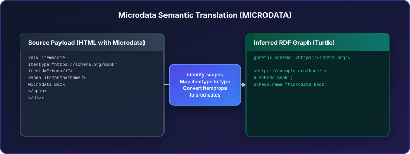{ width=95% }

### 16. Open Graph Protocol (`OPEN_GRAPH`)
*   **Specification**: Open Graph Protocol (ogp.me).
*   **LOD Discovery Role**: Extracts social media metadata tags from `<head>` and maps them to schema.org triples.
*   **Inference Semantics**: Maps properties (e.g., `og:title` to `schema:name`, `og:url` to `schema:url`).
*   **Inference Figure**:
    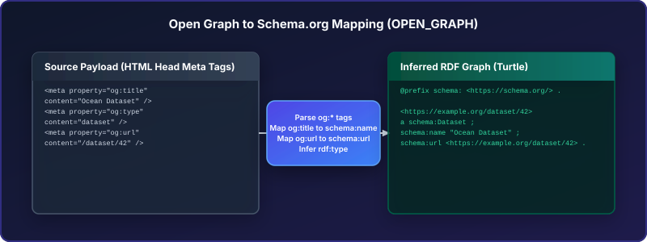{ width=95% }

### 17. Dublin Core Meta (`DUBLIN_CORE`)
*   **Specification**: ISO 15836 (Dublin Core DCMI Terms).
*   **LOD Discovery Role**: Standardizes metadata fields via head `<meta name="DC.x">` tags.
*   **Inference Semantics**: Prefixes keys with the Dublin Core terms namespace to produce triples.
*   **Inference Figure**:
    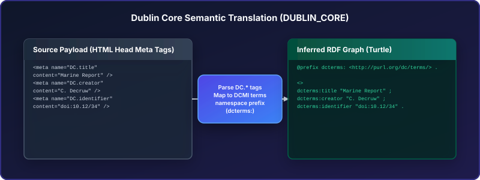{ width=95% }

### 18. Canonical URLs (`CANONICAL`)
*   **Specification**: RFC 6596 [@rfc6596].
*   **LOD Discovery Role**: Identifies primary URI targets, preventing crawler loop duplication.
*   **Inference Semantics**: Establishes identity link assertions with the canonical endpoint using the `xhtml:link` RDF structure.
*   **Inference Figure**:
    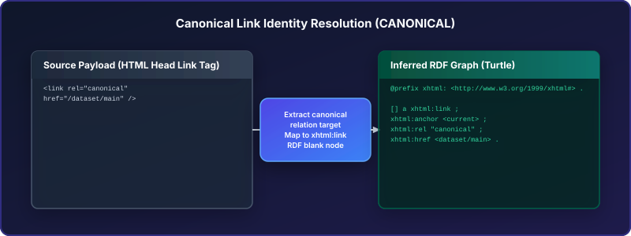{ width=95% }

### 19. HTTP Link Relations - Collection/Item (`HTTP_LINK_RELATIONS`)
*   **Specification**: RFC 8288 [@rfc8288].
*   **LOD Discovery Role**: Advertises structural parents or member items directly in HTTP response headers.
*   **Inference Semantics**: Maps HTTP header IANA link relations (e.g., `rel="collection"`, `rel="up"`) to uniform `xhtml:link` blank node structures.
*   **Inference Figure**:
    { width=95% }

### 20. Pagination Links - Prev/Next (`PAGINATION`)
*   **Specification**: HTML5 Standard Link Relations.
*   **LOD Discovery Role**: Navigates linear dataset listings sequentially page-by-page.
*   **Inference Semantics**: Extracts `rel="next"` and `rel="prev"` tags and maps them to sequence nodes using `xhtml:link` RDF blank nodes.
*   **Inference Figure**:
    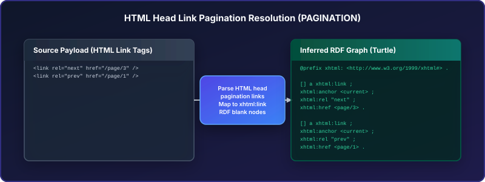{ width=95% }

### 21. Bidirectional Graph Links (`REVERSE_LINKS`)
*   **Specification**: Linked Data Principles [@linkeddata].
*   **LOD Discovery Role**: Tracks and validates reciprocal backlinks to ensure graph connectivity.
*   **Inference Semantics**: Checks for reciprocal backlink references and models the verified bidirectional links as `xhtml:link` triples.
*   **Inference Figure**:
    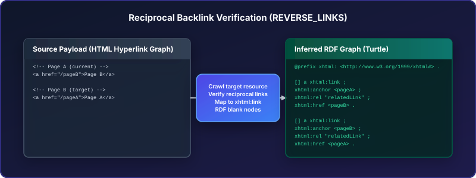{ width=95% }

### 22. Cyclic Loop Topologies (`CIRCULAR_GRAPHS`)
*   **Specification**: Linked Data Principles [@linkeddata].
*   **LOD Discovery Role**: Enables crawler cycle detection to prevent infinite parsing loops on circular paths.
*   **Inference Semantics**: Tracks visited history to detect loop paths and represents graph cycles using standard `xhtml:link` blank nodes.
*   **Inference Figure**:
    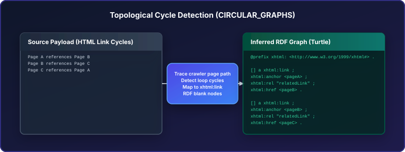{ width=95% }

---

## Quadrant 3: Domain-Level Direct RDF

Domain-level direct channels are host-wide endpoints that serve native RDF graphs directly, representing metadata catalogs or index mappings without requiring resource-local page parsing.

### 23. Well-Known Linkset Endpoints (`WELL_KNOWN` - Direct)
*   **Specification**: RFC 8615 & RFC 9264.
*   **LOD Discovery Role**: Accesses host-wide link indices served directly as native RDF linksets from well-known paths.
*   **Representation Semantics**:
    ```http
    GET /.well-known/api-catalog HTTP/1.1
    Accept: application/linkset+json
    ```

### 24. RDF Resource Map (`RESOURCE_MAP` - Direct)
*   **Specification**: OAI Object Reuse and Exchange (OAI-ORE).
*   **LOD Discovery Role**: Downloads native ORE resource maps that outline dataset formats and aggregations.
*   **Representation Semantics**:
    ```turtle
    <resourceMapUrl> a ore:ResourceMap ;
      ore:describes <aggregationUri> .
    ```

---

## Quadrant 4: Domain-Level Inferenced RDF

Domain-level inferenced channels are XML, JSON, or text documents hosted at domain roots. They serve as entry points for broad crawling and catalog bootstrapping, requiring parser mapping to translate feed items or sitemaps into RDF graphs.

### 25. RSS Feed Listing (`RSS_FEED`)
*   **Specification**: RSS 2.0 Specification.
*   **LOD Discovery Role**: Parses syndication files to discover newly added resources and update times.
*   **Inference Semantics**: Mapped channel nodes to `schema:DataCatalog` and item links to `schema:Dataset`.
*   **Inference Figure**:
    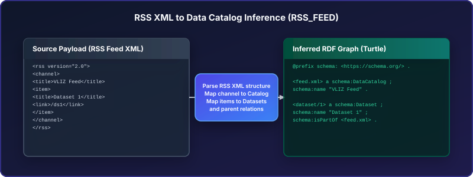{ width=95% }

### 26. Atom Feed Listing (`ATOM_FEED`)
*   **Specification**: RFC 4287.
*   **LOD Discovery Role**: Harnesses structured syndication entries to bootstrap crawler queues.
*   **Inference Semantics**: Maps Atom feed entry properties and link structures to catalog records.
*   **Inference Figure**:
    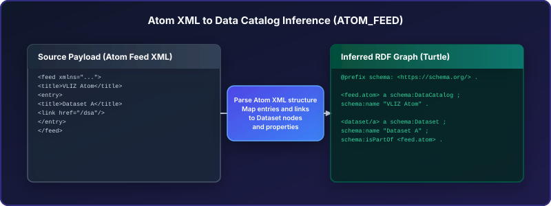{ width=95% }

### 27. XML Sitemap (`SITEMAP`)
*   **Specification**: Sitemaps.org Protocol.
*   **LOD Discovery Role**: Enumerates all indexable pages on the host for batch harvesting.
*   **Inference Semantics**: Extracts `loc` and `lastmod` keys and generates `dcat:CatalogRecord` assertions.
*   **Inference Figure**:
    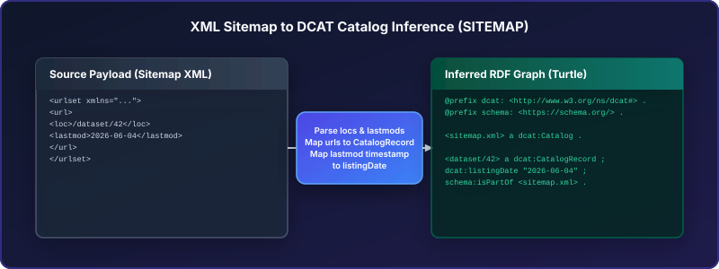{ width=95% }

### 28. Robots.txt References (`ROBOTS`)
*   **Specification**: RFC 9309 [@rfc9309].
*   **LOD Discovery Role**: Decodes the host policies to locate sitemap paths without deep page crawling.
*   **Inference Semantics**: Scans line-by-line for `Sitemap:` directives and maps them to the host domain.
*   **Inference Figure**:
    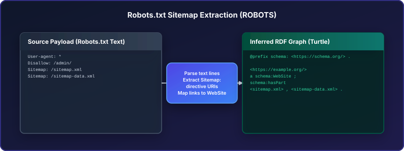{ width=95% }

### 29. Web App Manifest (`MANIFEST`)
*   **Specification**: W3C Web App Manifest.
*   **LOD Discovery Role**: Parses manifest JSON files to extract host identity and app parameters.
*   **Inference Semantics**: Translates properties to `schema:WebApplication` statements.
*   **Inference Figure**:
    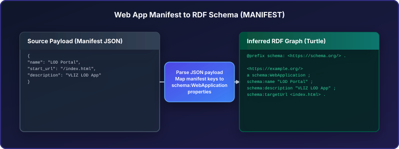{ width=95% }

### 30. Well-Known API Catalogs (`WELL_KNOWN` - Inferenced)
*   **Specification**: RFC 8615 & RFC 9727 [@rfc8615;@rfc9727].
*   **LOD Discovery Role**: Bootstraps API directories from well-known JSON endpoints.
*   **Inference Semantics**: Resolves keys (e.g., api catalogs) to `schema:WebAPI` and `schema:EntryPoint` nodes.
*   **Inference Figure**:
    { width=95% }

### 31. JSON API Catalog Discovery (`API_DISCOVERY`)
*   **Specification**: W3C Data on the Web Best Practices.
*   **LOD Discovery Role**: Scans API catalog pages to identify distributions and datasets.
*   **Inference Semantics**: Extracts endpoints and maps service targets using DCAT classes.
*   **Inference Figure**:
    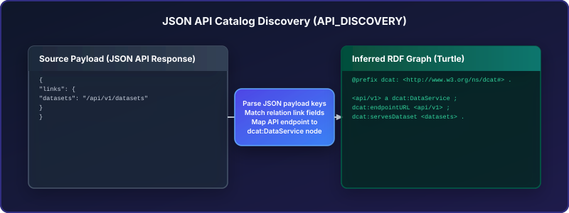{ width=95% }

### 32. Custom JSON Resource Map (`RESOURCE_MAP` - Inferenced)
*   **Specification**: OAI Object Reuse and Exchange (OAI-ORE).
*   **LOD Discovery Role**: Resolves conceptual resources to formats via host-wide JSON mappings.
*   **Inference Semantics**: Converts JSON aggregates arrays into aggregation relationships in the OAI-ORE ontology.
*   **Inference Figure**:
    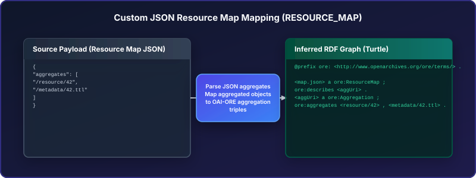{ width=95% }

---

## Why this deep dive matters

The taxonomy and detailed specs above provide more than descriptive documentation. They establish:

- **A strategy contract**: dictating exactly what content formats a compliant parser must process.
- **A confidence gradient**: ranking direct pathways (high confidence) above inferred mappings (lower confidence).
- **An optimization framework**: allowing crawlers to cascade gracefully from fast resource-level lookups down to deeper domain harvesting.

This makes the repository-generated environment an ideal validation corpus for testing discovery client completeness and compliance.

# Strategy Surface and Compliance Value

The repository operationalizes strategy metadata in `generator/strategies.ts`,
where each channel includes human-readable description, standards provenance,
location/extraction classification, and optional proposed retrieval design
[@lodrepo]. This creates a single source of truth for:

- Rendering channel documentation pages.
- Injecting matching markup/header artifacts.
- Enabling machine test plans that verify expected channel behavior.

In compliance terms, the matrix acts as a validation corpus for testing whether
a discovery client can:

- Detect direct RDF opportunities before expensive inference.
- Correctly parse and map inferenced metadata channels.
- Move from resource-local hints to domain-wide catalogs.
- Handle navigational structures (pagination, collections, backlinks, cycles)
  without over-crawling or semantic drift.

# Discussion

A major strength of `lod_docker_webserver` is that it treats web architecture as
a first-class test artifact. HTTP behavior, HTML metadata, RDF serializations,
and host-level documents are all generated from one controlled model and served
in one reproducible container deployment.

The implementation status note in the repository is also important: while the
payload ecosystem is richly generated, not every listed strategy is yet fully
executed by automated harvester logic [@lodrepo]. This is not a weakness of the
testbed concept; it is an explicit separation between *channel availability*
and *client implementation completeness*. In research and engineering practice,
that separation is healthy because it enables independent benchmarking of
crawler maturity.

# Conclusion

`lod_docker_webserver` is a substantial contribution to practical Linked Data
discovery engineering. It transforms abstract standards into a navigable,
runnable, and inspectable testbed where discovery behavior can be studied under
controlled conditions.

Its most distinctive value is the explicit taxonomy-driven framing from
`wrx_discovery_classification.md`: a structured model that links protocol
standards, extraction mechanics, and orchestration design. For teams building
robust LOD clients, FAIR-compliant metadata services, or conformance tests, this
repository provides both implementation scaffolding and conceptual clarity.
