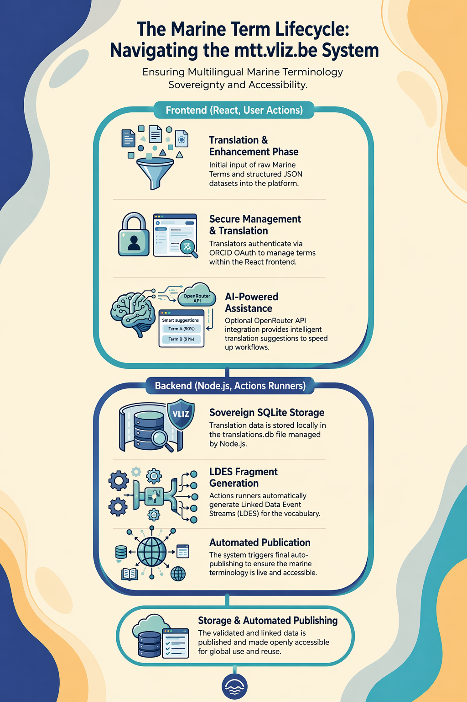

# Introduction

Marine research infrastructures rely on controlled vocabularies to make datasets
comparable across projects, countries, and disciplines. Networks such as
EMODnet and SeaDataNet demonstrate how shared terminology underpins data
exchange, catalog integration, and machine-assisted discovery across distributed
providers [@emodnet, @seadatanet]. Yet, despite broad adoption of marine
vocabularies, practical multilingual maintenance remains difficult. Many
terminology services are designed primarily for monolingual curation and only
secondarily for translation workflows. As a result, organisations that wish to
provide multilingual access often depend on ad hoc spreadsheets, disconnected
translation pipelines, or one-off projects that are hard to sustain over time.

This gap has practical consequences. Marine scientists, policy actors, and
operational teams frequently search and interpret datasets in their native
language, while authoritative terms are often maintained in English only.
Insufficient translation coverage weakens findability, introduces ambiguity, and
limits reuse of otherwise high-quality marine data products. From a FAIR
perspective, this primarily affects interoperability and reusability, where
controlled vocabularies and machine-readable semantics are expected to support
cross-context interpretation [@wilkinson2016fair].

Marine Term Translations (MTT) was created to address this operational gap: it
provides a lightweight, self-hosted platform that supports collaborative term
management, multilingual translation, and standards-based publication without
requiring institutions to outsource core governance workflows. The platform is
available as an online deployment and as open-source software that can be
installed in local infrastructures [@mtt_platform; @mtt_github].

The core thesis of this paper is that multilingual terminology governance should
be treated as a first-class, machine-actionable process rather than as an
auxiliary editorial task. MTT operationalizes this thesis through four design
choices: (1) fine-grained editorial workflows with provenance-ready updates,
(2) assisted translation with explicit human validation, (3) exports to
widely-used semantic formats, and (4) event-stream publication that allows
external consumers to synchronize terminology changes incrementally.

The remainder of the paper presents the background and requirements that shaped
MTT, details its architecture and data flows, reports beta-phase observations on
the BODC P02 translation effort, and discusses limitations and next steps toward
broader community adoption.

# Background and Related Work

## Controlled Vocabularies in Marine Data Infrastructures

Controlled vocabularies are the semantic backbone of marine metadata systems.
They constrain values for parameters, platforms, instruments, and other domain
entities, reducing ambiguity and supporting harmonized indexing. The NERC
Vocabulary Server collection P02, for example, is widely used for parameter
description and discovery in marine workflows [@bodc_p02].

In practice, controlled vocabularies serve two audiences at once: humans who
need readable labels and definitions, and machines that require persistent
identifiers and explicit semantic relations. Maintaining both dimensions across
multiple languages is difficult when tooling does not explicitly model
translation status, quality controls, and publication synchronization.

## FAIR Interoperability and Semantic Reuse

The FAIR principles articulate why these workflows matter beyond local use.
Interoperability and reusability require shared semantics, resolvable metadata,
and explicit formalization of terms and relations [@wilkinson2016fair]. In a
multilingual setting, this extends to language-tagged labels, transparent
versioning, and predictable publication endpoints that downstream systems can
consume automatically.

The combination of SKOS for concept organization and JSON-LD for Linked Data
serialization provides a practical foundation for this purpose [@skos; @jsonld].
However, FAIR-aligned publication alone does not solve editorial bottlenecks:
institutions still need operational tooling for curation, translation, review,
and release cycles.

## Authentication, Trust, and Editorial Accountability

Terminology governance is not purely technical; it is social and organizational.
Teams need confidence that edits can be attributed, reviewed, and audited.
ORCID offers a useful identity layer for research and data stewardship contexts
because it provides stable personal identifiers and broad community acceptance
[@orcid]. Integrating ORCID in editorial workflows helps tie modifications to
real contributors while maintaining low onboarding friction for distributed
collaborators.

## Why Existing Workflows Are Still Frictionful

Even where vocabulary services exist, multilingual extension often relies on a
sequence of tools that do not share a unified data model: source extraction from
a vocabulary registry, translation in external systems, manual review in office
documents, and delayed republishing in separate pipelines. This introduces
latency, duplicated effort, and format-conversion risks. MTT addresses these
frictions by bringing authoring, translation support, governance metadata, and
semantic publication into a single self-hosted workflow.

# Problem Statement and Design Goals

MTT was designed to answer a concrete question: how can a marine institution run
its own multilingual terminology workflow end-to-end while keeping outputs
machine-actionable and standards-compliant?

From this question, the following design goals were defined:

1. **Self-hostability and institutional control.** Deployable in local or
   sovereign cloud environments without dependency on vendor-managed backends.
2. **Collaborative governance.** Multi-user editing with role-aware access and
   attributable changes.
3. **Translation productivity.** Assisted suggestion workflows that accelerate
   translation while preserving expert review responsibility.
4. **Semantic publication interoperability.** Export and API outputs compatible
   with existing marine semantic infrastructures.
5. **Incremental synchronization.** Ability for external systems to consume
   updates continuously instead of re-harvesting complete vocabulary snapshots.
6. **Operational simplicity.** Commodity web technology stack and straightforward
   deployment model suitable for small and medium data teams.

These goals intentionally prioritize practical adoption over theoretical
completeness: MTT focuses on a robust baseline that can be integrated into
existing marine curation workflows with limited operational overhead.

# System Architecture

MTT follows a modular web architecture composed of a browser-based client,
server-side API, relational persistence, and standards-oriented publication
endpoints.

{ height=95% }

## Frontend Layer

The frontend is implemented in React and provides interfaces for project-level
management, concept-level editing, translation review, and publication actions.
The UI emphasizes side-by-side visibility of source terms, candidate
translations, and status metadata so editors can rapidly move between discovery,
validation, and approval tasks.

Interaction patterns are intentionally conservative: explicit save actions,
clear status indicators, and predictable navigation structures are favored over
complex automation in order to minimize editorial mistakes in high-volume
terminology work.

## API and Business Logic Layer

The Node.js backend exposes RESTful endpoints for term retrieval, edit
submission, workflow-state changes, and export orchestration. Business logic
enforces consistency constraints such as mandatory identifiers, language
completeness checks, and transition guards between draft, reviewed, and
published states.

The service layer also mediates between assisted-translation generation and
human moderation by persisting suggestions independently from accepted values,
ensuring that machine-generated output is never implicitly published.

## Persistence Layer

PostgreSQL stores concepts, labels, definitions, language variants, workflow
status, and change metadata. Relational modeling provides transactional
robustness for concurrent edits and supports incremental query patterns needed
for publication feeds and auditing.

In practice, the database schema separates stable concept identity from mutable
linguistic expressions. This allows multilingual values to evolve over time
without changing the persistent concept URI strategy expected by downstream
consumers.

## Identity and Access

MTT integrates ORCID authentication to associate editorial actions with
researcher identities [@orcid]. This choice supports cross-institutional
collaboration while limiting custom account-management complexity. It also
improves governance traceability, as each accepted translation can be associated
with a known contributor profile.

# Data Model and Semantic Interoperability

## Concept-Centric Representation

The platform models each term as a stable concept enriched by labels,
definitions, and metadata across one or more languages. This maps naturally to
SKOS constructs, where preferred labels, alternative labels, and semantic
relations can be serialized for reuse [@skos].

By separating concept identity from language realization, MTT allows parallel
translation work without introducing URI churn. This is especially important in
marine infrastructures where external services may cache or reference concept
URIs for long periods.

## Export Formats and Integration Boundaries

MTT supports CSV export for operational interoperability with spreadsheet-based
or legacy tools, and SKOS/JSON-LD exports for semantic web integration
[@skos; @jsonld]. The dual export strategy reflects real-world adoption paths:
teams can begin with familiar tabular workflows while progressively enabling
Linked Data-native integrations.

Export generation is deterministic with respect to approved workflow state,
which helps avoid accidental leakage of unreviewed translations into production
consumption pipelines.

## Mapping to FAIR Expectations

The data model contributes to FAIR-aligned practice by supporting persistent
identification, rich machine-readable metadata, and explicit serialization for
interoperable reuse [@wilkinson2016fair]. MTT does not claim to solve FAIR
compliance by itself; rather, it provides a concrete operational substrate that
makes FAIR implementation achievable in routine editorial work.

# Translation Workflow and Editorial Governance

## Collaborative Editing Lifecycle

MTT structures translation work as a lifecycle with explicit checkpoints:
creation or import, candidate generation, expert review, approval, and
publication. This lifecycle clarifies responsibility boundaries and prevents the
common failure mode where draft multilingual values are interpreted as final.

Editors can focus on domain quality, while platform constraints ensure that
status transitions are auditable and reproducible.

## AI-Assisted Suggestion Model

The system includes AI-assisted suggestions to reduce repetitive manual effort,
particularly for large vocabulary batches. Suggestions are presented as
proposals, not as accepted translations. Human reviewers remain the publication
authority and can modify, reject, or defer any suggestion.

This human-in-the-loop pattern is crucial in marine terminology, where subtle
context differences can affect downstream data interpretation. Productivity gains
must therefore be balanced with precision and governance accountability.

## Versioning and Change Traceability

Each approved update contributes to a version-aware history that records what
changed, when, and by whom. This enables rollback, audit support, and transparent
coordination across teams. In cross-institution workflows, the ability to trace
term evolution is often as important as the final translated value.

# Event-Stream Publication with LDES

## Motivation for Incremental Publication

Traditional vocabulary publication often relies on periodic full dumps.
While simple, this approach is inefficient for downstream systems that only need
changes since the last synchronization point. MTT addresses this by publishing
Linked Data Event Streams (LDES), enabling clients to consume incremental term
updates [@ldes_spec].

## LDES Integration Pattern

When approved terminology records change, MTT emits corresponding stream events
that encode update semantics in RDF. Consumers can poll or follow the stream and
synchronize local stores without repeatedly downloading full collections.

This model improves machine-actionable interoperability in ecosystems where many
consumers monitor overlapping but non-identical terminology subsets.

## Operational Benefits and Trade-offs

LDES publication lowers integration latency and reduces data-transfer overhead
for downstream harvesters. It also supports more frequent release cycles because
publishers no longer need to coordinate monolithic snapshot distribution for
small updates.

The trade-off is additional operational complexity for stream consistency and
consumer onboarding. MTT mitigates this with clear endpoint structure and
conservative event publication tied to reviewed workflow states.

# Deployment and Operations

MTT is designed as a self-hosted platform with modest infrastructure
requirements. The frontend and backend can be deployed through standard web
infrastructure patterns, while PostgreSQL provides durable storage and backup
integration options.

This deployment model is relevant for institutions that require data governance
control, internal security review, or integration with local identity and
network policies. Rather than assuming centralized SaaS operation, MTT supports
federated adoption where each institution can tune policies to local needs while
preserving exchange interoperability through shared semantic standards.

Because the platform is open source, technical teams can inspect and adapt the
implementation to domain-specific constraints [@mtt_github]. This transparency
also supports reproducibility and trust in terminology governance processes.

# Evaluation: Beta Translation of BODC P02

## Study Context

To assess operational usefulness, MTT was used in beta mode on a subset of the
BODC P02 Parameter Discovery Vocabulary [@bodc_p02]. The target was to produce
validated Dutch and French translations for a substantial segment of the
collection while maintaining publication-readiness for machine consumption.

## Observed Outcomes

During the beta period, approximately 25% of the target collection was
translated and prepared for publication. The resulting vocabulary state was made
available through MTT endpoints and LDES publication, demonstrating end-to-end
continuity between editorial work and interoperable dissemination
[@mtt_platform; @ldes_spec].

Qualitative observations from the workflow indicate three practical gains:

1. **Reduced coordination overhead.** Shared status tracking lowered ambiguity
   between translators and reviewers.
2. **Faster iteration cycles.** Assisted suggestions accelerated first-pass
   drafting, especially for concept batches with repetitive lexical patterns.
3. **Improved publication readiness.** Built-in semantic export and stream
   publication reduced handoff friction to consuming systems.

## Interpretation

The beta result should be interpreted as an operational feasibility indicator,
not as a final benchmark of linguistic quality or full-collection coverage. The
primary evidence is that multilingual enrichment can progress in a governed,
machine-actionable workflow without introducing a bespoke integration stack for
each release cycle.

# Discussion

MTT illustrates that multilingual terminology management benefits from a single
platform that combines governance, semantic modeling, and publication. By
keeping these layers integrated, teams can move from isolated translation tasks
to continuous interoperability operations.

Several limitations remain. First, translation quality still depends on domain
expert review capacity, which can become a bottleneck for rapid scaling.
Second, interoperability gains are strongest when downstream consumers also
adopt stream-aware ingestion patterns. Third, governance policies vary across
institutions, so role and workflow models may require adaptation beyond the
baseline implementation.

Even with these limitations, MTT provides a practical middle path between
manual spreadsheet-driven workflows and heavyweight enterprise terminology
systems. Its architecture is intentionally simple enough for adoption by small
technical teams while preserving standards alignment for broader ecosystem use.

# Future Work

Future development will focus on four areas:

1. **Coverage expansion.** Extend multilingual support to additional marine
   collections and language sets.
2. **Quality analytics.** Add workflow metrics for translation confidence,
   review throughput, and change stability.
3. **Interoperability profiles.** Provide implementation guides and profile
   mappings for common marine infrastructure integration scenarios.
4. **Governance automation.** Introduce configurable policy checks that assist
   reviewers without replacing expert judgment.

A broader evaluation program is also planned to compare terminology adoption and
search impact before and after multilingual enrichment across participating
projects.

# Conclusion

Marine data interoperability requires more than authoritative concept lists: it
requires sustained, multilingual, machine-actionable governance processes. MTT
contributes such a process through a self-hosted, open-source architecture that
combines collaborative editing, assisted translation, standards-based exports,
and LDES publication.

The beta translation of part of the BODC P02 vocabulary demonstrates that this
approach is operationally viable and immediately useful for marine
infrastructures seeking cross-lingual semantic enrichment. By aligning editorial
practice with FAIR-oriented interoperability mechanisms, MTT helps reduce the
gap between local terminology curation and reusable web-scale semantic
integration.

# Declaration on Generative AI

This manuscript was prepared with support from generative AI tooling for
language refinement and structural editing. The system
description was defined by the authors.

# Ethical Considerations and Environmental Footprint

**Ethical considerations.** MTT focuses on terminology curation and does not
process personal data or sensitive marine observation subjects. Editorial identities are
managed through ORCID-based authentication in line with contributor
accountability practices [@orcid].

**Environmental footprint.** The platform uses conventional web components and a
relational database stack with modest infrastructure requirements. Incremental
LDES publication reduces repeated full-harvest transfers, which can lower data
movement overhead in downstream synchronization scenarios [@ldes_spec].

# References {-}

<!-- Bibliography is loaded from references.bib -->
